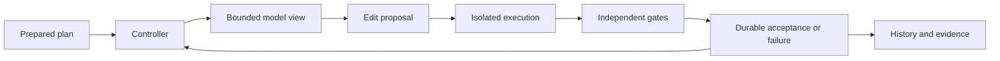

# Architecture

GFLO implements a prepared-task execution loop. A trusted caller supplies the work
contract, immutable Python source, model deployment profile, and independent gates.
Autonomous product planning and checkout promotion are future work.

## Authority

The controller owns scheduling, leased attempts, validation, and acceptance. The
model can propose complete file replacements within granted paths or request a
file from the immutable source bundle. It cannot accept work, alter gates, delete
files, access host files, or grant itself tools. Controller and worker orchestration
currently share a process; the code execution sandbox is a separate container.

`bounded-python-v4` composes source, requirements, up to sixteen verified upstream
contract excerpts, and bounded readable failure observations. Excerpts are limited
to 16,384 characters each and still subject to the exact overall tokenizer budget.
Task text is untrusted data. Expected gate outputs stay outside the worker view.
Opaque cross-bundle dependency artifacts are not supported by this worker profile.

The model client accepts a numeric-loopback HTTP endpoint, serializes requests,
and checks the server's tokenizer and usage. The routine budget is 8K tokens with
2K reserved for output, temperature 0, seed 42, and thinking disabled. The explicit
`vllm-python-worker-reasoning-v1` model profile enables thinking for both exact
tokenization and generation. Its reasoning and final answer share the atom's output
reserve; changing the profile does not enlarge that reserve. Reasoning text is
retained as untrusted response evidence, never parsed as a candidate. Malformed or
truncated responses retain diagnostic evidence. There is no cloud fallback.

## Execution and validation

The broker accepts self-contained text bundles: at most 100 paths and 256 KiB of
serialized source. Each process runs in a fresh local Docker container, with no
network, credentials, host checkout, Docker socket, or GPU. It uses UID/GID 65534,
a read-only root, bounded tmpfs, dropped capabilities, 128 MiB RAM, no additional
swap, one CPU, and 32 PIDs. Qualification checks actual memory and PID enforcement.
The Docker daemon and shared host kernel remain trusted infrastructure.

Process gates compare observed output with controller-owned expectations. Every
case runs independently, separate from candidate smoke execution. Receipt checks
bind candidate, command, stdin, purpose, image, and container identity. Malformed
or mismatched evidence is inconclusive. Finite gates can miss defects; later
contradictory evidence is an [Acceptance finding](operations.md#acceptance-findings).

This capability does not install dependencies, build arbitrary repositories, or
export mutable container workspaces. Binary assets and general shell workflows
need additional capabilities and qualification.

## Durable state and integration

SQLite stores contracts, attempts, events, receipts, and acceptances with WAL and
FULL synchronization. Leases fence stale results. The artifact store publishes
immutable bytes by content hash; referenced bytes are reverified on reuse. There
is no garbage collection. Together these support retry, crash recovery, cumulative
cost reporting, and candidate diffs against the original source.

Prepared integration combines non-overlapping accepted changes from one pinned
base. It rechecks child contracts, candidate hashes, current input identities, and
upstream contracts, then runs independent combined gates. Children must have
RunPlans; nested IntegrationPlans are not supported. The caller owns current-state
accuracy. Integration produces an artifact, not an atomic Git or deployment update.

For the domain vocabulary see [CONTEXT.md](../CONTEXT.md); for commands and recovery
semantics see [Operations](operations.md).

## Repository-scale source access

[ADR 0001](adr/0001-repository-snapshots-and-bounded-task-inputs.md) separates
repository identity from bounded task inputs. `gflo.repository` now provides real
legacy-bundle and immutable-snapshot backends: scoped listing, exact line reads,
bounded literal search, context/execution selection, and digest-bound edits.
Results identify the snapshot and files and report incomplete coverage. Edits
preserve every unselected file, rejecting stale bases and missing source evidence.
Historical bundle and record identities remain unchanged.

Capture inventories Git-visible UTF-8 text, including dirty and nonignored untracked
files, and checks inventory/content again before publishing. It requires a quiescent
checkout; it is not an atomic filesystem snapshot. Symlinks, submodules, binaries,
unresolved merges, and unsupported paths are rejected. Limits are 100,000 files,
8 MiB per file, and 512 MiB total. Same-store edit assembly verifies all original
file bytes but stores only changed blobs and a new manifest. No garbage collection
or cross-store snapshot export is implemented.

Legacy `FeatureRequest.source`, `RunPlan.source`, and candidate construction still
embed bounded `SourceBundle` objects with their original meanings. New repository
feature requests use snapshot references. The planner selects a bounded projection;
`gflo.preparation` materializes reviewed tasks into existing RunPlans. The sequential
`gflo.progression` controller advances accepted snapshots, binds predecessor evidence,
and rechecks findings before reuse. Independent final gates use a validation-only
record, not a model task. Repeated calls reconstruct progress from immutable evidence.
See [product intake](product-intake.md) for commands and qualification limits.

Search currently scans text with explicit file/byte/hit budgets; no symbol or graph
index exists. Revision-bound symbol and dependency queries can be added behind the
module without coupling scheduling to graph storage. The task dependency graph
orders work; repository dependencies provide impact evidence. Large-repository
qualification still needs selection sufficiency, freshness, resource measurements,
and repeated whole-feature correctness on real repositories.

## Relationship to SFLO and Gas City

The original [foundation decision](../.scratch/local-lights-out-factory/research/orchestration-foundations.md)
selected a small GFLO core borrowing contracts rather than adopting either runtime.
SFLO documents artifact-gated product stages with distinct PM, developer, QA and
security roles. Gas City provides configurable multi-agent orchestration primitives,
including work tracking/routing and reconciliation. See their current
[SFLO](https://github.com/simonasrazm/simon-factory-lights-out) and
[Gas City](https://github.com/gastownhall/gascity) descriptions (checked 2026-09-10).

GFLO follows those ideas through bounded work, retained artifacts, separate validation,
and durable progress. It does not implement SFLO's exact pipeline or Gas City's
runtime. The optional specialist board is a GFLO planning-policy experiment above
that core. Its consensus has no acceptance authority. More roles become defaults
only when measured outcomes justify the additional coordination and model cost.
