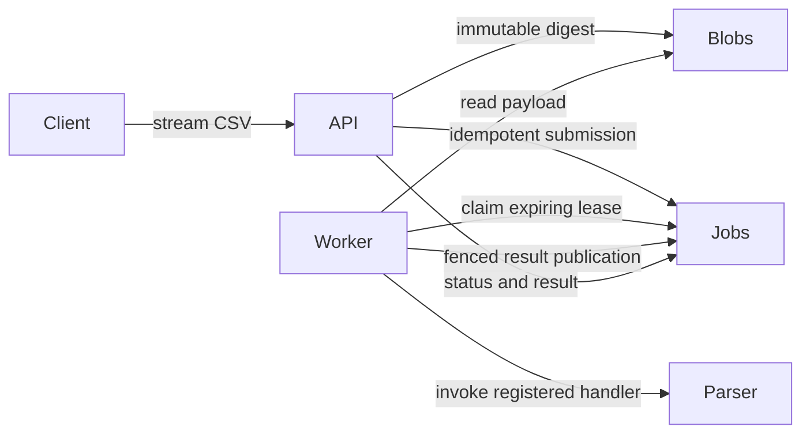

# Importflow POC and qualification status

Importflow is the chosen CSV inventory-import workload for testing a reusable Python
factory workflow. A trusted reference implementation passes the current correctness
and runtime checks. **The local model has not produced a qualifying application.**
References are test infrastructure, not model deliveries or evidence of unattended
project creation. The owner selected small-task factory reliability work before resuming the application.
See the [repair comparison](../.scratch/local-lights-out-factory/repair-comparison/README.md).

## Intended implementation

The payload module streams bytes into content-addressed files. The parser aggregates
incrementally with explicit row and label limits. The durable job module owns
idempotency, capacity, claims and completion through four concrete operations.
Handlers execute outside database transactions and vary independently of storage.
A killed worker leaves an expiring lease; stale tokens cannot publish results.
Results are per import, with one durable publication. This does not promise exactly
once execution or transactions involving external side effects.

SQLite WAL provides the single-host baseline. Multiple workers, bounded memory,
short transactions and independent handlers are concrete reuse/scaling mechanisms.
Multi-host operation still needs a shared payload store, a suitable database adapter
and further qualification. The factory's larger-source execution adapter is also
still outstanding; the separate runtime audit does not remove its 256 KiB limit.

## What has been checked

Reference gates cover malformed CSV, exact row diagnostics, Unicode/newline/type
boundaries, stream memory limits, atomic payload publication, duplicate submission,
eight-process submission/claim races, abandoned-worker recovery, stale completion,
real handler reuse, HTTP errors, offline installation and generated-test fault checks.

A separate Docker audit tests a roughly 64 MiB real HTTP upload (554,618 records),
duplicate/conflicting submissions, oversize rejection and 500 small jobs with four
worker processes. Its explicit profile is 512 MiB memory, two CPU cores, 32 PIDs and
256 MiB temporary storage, with no network beyond container loopback or host mounts.
Temporary storage is memory-backed: these numbers do not establish persistent-disk
production throughput, multi-host performance or an SLA. Worker gates retain their
historical 128 MiB profile and smaller input/storage limits.

The original image used SQLite 3.46.1. SQLite reports that release as affected by the
WAL-reset race. The admitted replacement links upstream 3.51.3 through the system
loader; broker and child-process probes verify linkage after environment sanitization.
An initial LD_LIBRARY_PATH-only image did not survive that sanitization and is retained
as a failed preparation approach. [SQLite advisory](https://www.sqlite.org/wal.html#walreset).

## Factory results

Whole-project planning exhausted six responses in the first trial and exceeded
context admission in the second; the third never started. A separately recorded
operator-prepared plan then ran three new model builds. All halted: the furthest
passed blob and job modules but failed CSV validation. One further bounded
continuation preserved and rechecked those modules on the corrected image, fixed
empty-input handling, then exhausted retries on row diagnostics and another CSV case.
No failed attempt was reset and no generated source was manually repaired.

`gflo.qualification.prepared_planner` supplies a frozen, request-bound proposal to
the normal policy compiler and records `operator-prepared-v1` provenance. It cannot
expand write scope or bypass gates. This is reusable supervised task preparation;
it does not claim autonomous planning success.

[Portable brief, source references, checks and results](../.scratch/local-lights-out-factory/importflow/README.md)
retain all costs and interventions. No Importflow application is currently exported
as a qualified factory delivery.
