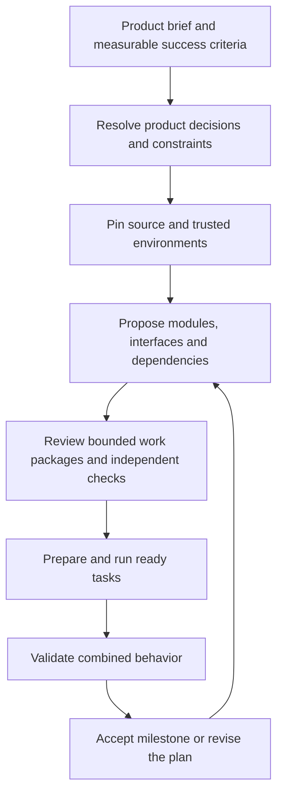

# From a product brief to bounded work

A factory should not need to fit an entire product or repository into one model's
context. The useful part of a CEO/manager/worker hierarchy is responsibility:
each level owns an outcome, delegates explicit contracts, and checks how the pieces
fit together. More manager agents alone do not establish correctness or scale.

The intended intake flow is:



At intake, identify users, important workflows, requirements, non-goals, operational
constraints, and examples of success and failure. Inspect an existing repository
before assigning ownership. For a new product, supply a reviewed scaffold and
trusted environment first; empty snapshots and automatic environment provisioning
are not supported by the current preparation path.

A manager should pass down relevant requirements, exact provider interfaces,
writable ownership, dependencies, budgets, and escalation conditions. Workers need
bounded source and concrete acceptance criteria. Managers need evidence-backed
results and unresolved risks, rather than every source file. Shared interfaces
need independent combined checks even when each child passes. Decisions that change
product scope or invalidate a contract must propagate upward and trigger replanning.

## Implemented preparation path

`RepositoryFeatureRequest` identifies the product objective, requirements, immutable
snapshot, allowed writes, and trusted environment catalog. `PlanProposal` describes
at most 12 tasks and binds to the exact request digest. The existing `plan-feature`
command still drafts from its legacy bounded `FeatureRequest`; it does not yet
autonomously draft from `RepositoryFeatureRequest`. Snapshot-backed proposals must
currently be supplied by the trusted caller or another explicitly reviewed process.
Do not rewrite a legacy proposal's request digest and assume it has been reviewed.

A separately supplied `PlanReview` binds the request and proposal digests, provides
explicit context/execution paths and ProcessGates per task, and pins model/deployment
and retry/context budgets. It is a trusted controller input, not a signed approval
or a field the proposing model may authorize. A valid structure does not prove the
reviewer's checks are sufficient. Whole-feature acceptance needs separate checks.

```sh
gflo prepare-task request.json proposal.json review.json TASK_ID \
  --store .gflo/repository-artifacts --current SNAPSHOT_DIGEST > prepared.json
python3 - <<'PY'
import json
from pathlib import Path
package = json.loads(Path('prepared.json').read_text())
Path('run.json').write_text(json.dumps(package['run'], indent=2) + '\n')
PY
gflo --db .gflo/product.sqlite3 submit-run run.json
```

Record schemas are available through `model_json_schema()` on
`gflo.preparation.RepositoryFeatureRequest`, `PlanReview`, and
`gflo.planning.PlanProposal`. Preparation publishes immutable evidence and emits a
package without submitting or running it. `submit-run` uses the existing controller;
`run ATOM_ID` executes only after the explicit submission step. The trusted caller
must check that the current snapshot is still current at scheduling and reuse.

Preparation rejects unresolved questions, mismatched review, missing declared reads,
omitted existing writable files, over-budget selections, and dependent tasks.
Only independent root tasks can currently be prepared: a consumer must wait for
accepted provider results and a reviewed current base. Supplying an unchecked
candidate as that base would bypass the intended progression contract.

The worker initially sees the selected context; its existing read tool can request
other execution files. Thus context selection controls presentation, not an access
barrier inside the execution bundle. A task must fit the existing 100-file/256-KiB
execution capability. An oversized directory write scope requires finer ownership
or a qualified larger execution capability, not silent omission.

`lift_candidate(store, prepared_digest, candidate, current_source=...)` restores a
task result into a proposed snapshot while preserving every omitted file. It rejects
deletions, writes outside scope, stale bases, and missing original evidence. It does
not grant acceptance, merge Git, or advance dependent tasks.

## Next qualification

Implement accepted-base progression with retained acceptance/finding checks and
independent integration gates. Then trial a complete multi-task feature repeatedly,
including failed providers, contract changes, stale consumers, and restart recovery.
Extend snapshot-backed planning/navigation before recursive delegation. Add symbol
and dependency indexing against measured selection failures. Larger isolated builds,
recursive manager budgets, and million-line product work remain unqualified.
