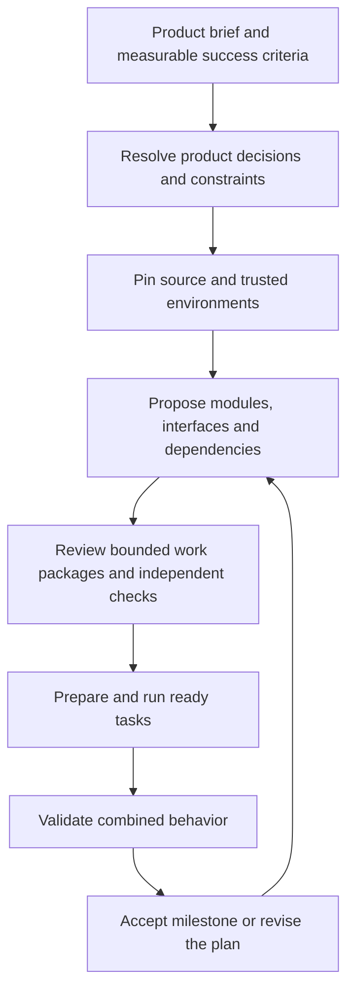

# From a product brief to bounded work

A factory should not need to fit an entire product or repository into one model's
context. The useful part of a CEO/manager/worker hierarchy is responsibility:
each level owns an outcome, delegates explicit contracts, and checks how the pieces
fit together. More manager agents alone do not establish correctness or scale.

The intended intake flow is:



At intake, identify users, important workflows, requirements, non-goals, operational
constraints, and examples of success and failure. Inspect an existing repository
before assigning ownership. For a new product, supply a reviewed scaffold and
trusted environment first; empty snapshots and automatic environment provisioning
are not supported by the current preparation path.

A manager should pass down relevant requirements, exact provider interfaces,
writable ownership, dependencies, budgets, and escalation conditions. Workers need
bounded source and concrete acceptance criteria. Managers need evidence-backed
results and unresolved risks, rather than every source file. Shared interfaces
need independent combined checks even when each child passes. Decisions that change
product scope or invalidate a contract must propagate upward and trigger replanning.

## Implemented planning and execution

`RepositoryFeatureRequest` identifies the product objective, requirements, immutable
snapshot, allowed writes, and trusted environment catalog. `plan-feature` accepts
this record or the unchanged legacy `FeatureRequest`. Snapshot planning uses an
explicit bounded source selection; the model sees coverage and cannot assume an
omitted file is absent. Only two selected files remain visible after reads. Planning
v3 allows two attempts of three turns, with a 12K total/4K output token budget and
retained read history. It can return either a `PlanProposal` or `PlanQuestions`.
Questions produce `needs-info`, no executable tasks, and no permission to invent
missing product policy. A plan still requires review, even with no questions.

```sh
gflo repository --store .gflo/product.sqlite3.artifacts capture .
gflo plan-feature request.json --store .gflo/product.sqlite3.artifacts \
  --context-path PATH --profile profile.json --deployment deployment.json --output .gflo/draft
gflo check-plan request.json .gflo/draft/proposal.json --store .gflo/product.sqlite3.artifacts
```

Use the returned snapshot digest in the request. `PATH` is a real file needed for
planning; repeat `--context-path` for additional files. The output directory must be
new. Planning writes a proposal or questions and observations; it never launches tasks.

A controller-authored `PlanReview` binds exact request and proposal digests. It
provides per-task context/execution paths and ProcessGates, and pins model/deployment
and retry/context budgets. These are trusted inputs, not model-approved tests or
signed human approvals. `FeaturePlan` combines the request, proposal, review, an
independent integration `TaskReview`, and its environment ID. Schemas are available
through `model_json_schema()` on these classes in `gflo.planning`, `gflo.preparation`,
and `gflo.progression`. The old `gflo.preparation.RepositoryFeatureRequest` import
remains available.

```sh
gflo --db .gflo/product.sqlite3 run-feature reviewed-feature.json --current SNAPSHOT_DIGEST
```

The snapshot must be in that ledger's artifact store. This command executes the
reviewed graph sequentially in deterministic dependency order. Each accepted task
advances an internal immutable snapshot; later tasks retain original plan/review
bindings and exact predecessor acceptance evidence. Consumers may reference files
created by declared providers, but preparation fails if those files are still absent.
A failed task stops progression. Final independent gates run against an explicit
combined execution selection, with no model call to approve the result.

Repeat the same command to resume. Progress is reconstructed from prepared tasks,
acceptances, candidates, and receipts rather than a mutable summary file. Reuse
rechecks findings and evidence, including ancestor findings before direct consumer
execution/reuse. Interrupted validation can resume without repeating model work.
Historical acceptance stays immutable; a later finding blocks reuse through these
controllers. This does not revoke artifacts exported to other systems.

The CLI checks the supplied current digest, not a live checkout. Python callers can
supply a current-source callback; they must own the external source while running.
No Git merge, checkout mutation, deployment, or automatic adoption of the final
snapshot occurs. A returned feature acceptance covers its supplied finite gates,
not arbitrary behavior of the whole repository. The result includes integration
selection coverage.

`prepare-task` remains available for independent root tasks without submission or
execution. `lift_candidate` preserves omitted files and returns a proposed snapshot;
it grants no acceptance. The graph controller performs accepted-base progression.

Each task and final validation still fits the broker's 100-file/256-KiB execution
limit. Context selection controls the initial presentation; the worker read tool
can request other execution files. Snapshot worker provenance permits at most twelve
accepted predecessor records, without loading their source into model context or
relaxing sandbox restrictions. Legacy worker profiles keep their existing semantics.

## Qualification and next work

One well-specified expense-report feature was planned locally and executed three
times: four tasks per execution, 12 accepted tasks in 12 attempts, and independent
combined checks including 25 generated valid inputs and five invalid inputs per
build. Omitted source survived and replay did not call the model again. These runs
used controller-authored checks and existing scaffold interfaces.

A deliberately underspecified currency/month extension initially exhausted both
planning attempts rereading files. The first clarification implementation then
exposed an output-envelope mismatch. Both failures are retained. After explicit
clarification output and envelope instructions, the planner returned the missing
policy/schema questions in one turn. This is a narrow escalation probe, not broad
CEO qualification. See [evaluation](evaluation.md) for retained evidence.

Next, vary products and interface ambiguity, test managers' failure detection and
escalation, and measure context-selection failures before adding recursive managers.
Symbol/dependency indexing, larger isolated builds, automatic environment setup,
and million-line product work remain unqualified. Snapshot capture/edit replay
still reads original source bytes; current measurements do not establish efficient
large-repository execution.

## Optional specialist-board experiment

`plan-feature --board` runs four independent perspectives (product, architecture,
validation, operations), then a coordinator if no specialist raises questions or
blockers. A blocker immediately returns `needs-info` with the specialist’s questions;
remaining roles and synthesis are skipped. It requires a snapshot request and the
same `--store`/`--context-path` arguments as single planning. It is opt-in; ordinary
`plan-feature` remains the default. These are sequential calls to the configured
local model, not statistically independent models or parallel GPU workers.

Reports bind the exact request and contain bounded findings, requirement IDs,
source-path references, and questions. Paths are checked against available source;
that does not prove the interpretation of a cited file is correct. The coordinator
must reference all four report digests and account for every finding. Any unresolved
specialist question or blocker prevents a question-free plan. Reports, dispositions,
and disagreements remain reviewable even when synthesis fails.

Each stage retains the existing two-attempt/three-turn, 12K/4K planning limits. The
whole board therefore permits at most 30 model calls and 368,640 reserved total
tokens across calls. Combined reports must fit 12,000 serialized bytes; an oversized
board stops instead of silently discarding findings. This costs substantially more
than one planner unless improved outcomes justify it. A new output directory is
required, and every stage retains its observations on failure.

A board proposal still needs a controller-authored PlanReview and independent gates.
It does not alter leases, workers, acceptance, recovery, or repository promotion.
Recursive manager trees are not implemented by this option.


## Build from a trusted feature policy

`build-feature` closes the manual proposal-to-review handoff for a bounded feature.
An operator supplies a `FeaturePolicy` bound to the exact request digest, with a
ProcessGate for every exact permitted output file, independent integration gates,
execution and planning paths, a pinned environment/model, and retry/token budgets.
The factory drafts a single-planner proposal, compiles its task graph into the
existing reviewed FeaturePlan, then executes and validates it. No per-task review
editing is required when the proposal fits the policy.

Gate selection follows exact writable files, not model-written acceptance prose or
claimed requirement coverage. Directory scopes, missing checks, unhandled reads,
unknown environments, missing output producers, questions, and excess budgets
halt rather than acquire new authority. Each task must satisfy its file's complete
check; policies that require unfinished future work can therefore halt a build.
Trusted checks still need operator engineering and review. This command does not
make arbitrary product requests safe or fully specified.

The reservation covers six planning calls at 12,288 tokens each plus
`max_tasks * max_attempts * max_model_turns * context_budget.total_tokens`.
It is a conservative admission bound, not measured token consumption or a shared
quota across separately started builds. Existing execution/context size limits and
offline Docker restrictions remain unchanged. Accepted snapshots are retained as
artifacts; the command does not modify or promote a Git checkout.

To recreate and run the measured fixture (requires the existing GPU deployment and
pinned worker image; preparation itself runs no model or product code):

```sh
PYTHONPATH=. .venv/bin/python scripts/prepare_policy_trial.py --output .gflo/policy-demo
.venv/bin/python -m gflo --db .gflo/policy-demo/ledger.db build-feature \
  .gflo/policy-demo/request.json .gflo/policy-demo/policy.json \
  --output .gflo/policy-demo/build \
  --current a59731e3c757ebc3660055fdf92ba74270ac788a95c6582c707701fe30424f59
```

The source snapshot must already be in the ledger's artifact store; the preparation
script supplies it for this fixture. `--current` asserts the external snapshot
identity, just as with `run-feature`; it is not a live Git watch. Library callers
can supply a current-source callback. Keep build output in trusted control-plane
storage, outside worker inputs.

Repeat the same command to replay execution from retained evidence. It checks the
request, policy, store location, and saved proposal digest; it never silently
replans. Planning exhaustion/interruption needs a new build directory. A changed
request or policy also needs a new build. The live trial passed three tasks and
final checks; its ambiguous variant returned questions without executing. See
[evaluation](evaluation.md) and the [portable fixture](../.scratch/local-lights-out-factory/policy-build-fixture.json).
