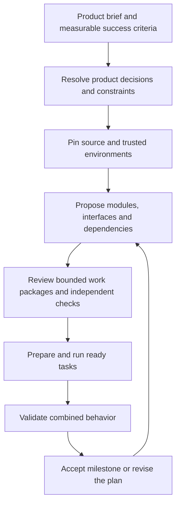

# From a product brief to bounded work

A factory should not need to fit an entire product or repository into one model's
context. The useful part of a CEO/manager/worker hierarchy is responsibility:
each level owns an outcome, delegates explicit contracts, and checks how the pieces
fit together. More manager agents alone do not establish correctness or scale.

The intended intake flow is:



At intake, identify users, important workflows, requirements, non-goals, operational
constraints, and examples of success and failure. Inspect an existing repository
before assigning ownership. For a new product, supply a reviewed scaffold and
trusted environment first; empty snapshots and automatic environment provisioning
are not supported by the current preparation path.

A manager should pass down relevant requirements, exact provider interfaces,
writable ownership, dependencies, budgets, and escalation conditions. Workers need
bounded source and concrete acceptance criteria. Managers need evidence-backed
results and unresolved risks, rather than every source file. Shared interfaces
need independent combined checks even when each child passes. Decisions that change
product scope or invalidate a contract must propagate upward and trigger replanning.

## Implemented planning and execution

`RepositoryFeatureRequest` identifies the product objective, requirements, immutable
snapshot, allowed writes, and trusted environment catalog. `plan-feature` accepts
this record or the unchanged legacy `FeatureRequest`. Snapshot planning uses an
explicit bounded source selection; the model sees coverage and cannot assume an
omitted file is absent. Only two selected files remain visible after reads. Planning
v3 allows two attempts of three turns, with a 12K total/4K output token budget and
retained read history. It can return either a `PlanProposal` or `PlanQuestions`.
Questions produce `needs-info`, no executable tasks, and no permission to invent
missing product policy. A plan still requires review, even with no questions.

```sh
gflo repository --store .gflo/product.sqlite3.artifacts capture .
gflo plan-feature request.json --store .gflo/product.sqlite3.artifacts \
  --context-path PATH --profile profile.json --deployment deployment.json --output .gflo/draft
gflo check-plan request.json .gflo/draft/proposal.json --store .gflo/product.sqlite3.artifacts
```

Use the returned snapshot digest in the request. `PATH` is a real file needed for
planning; repeat `--context-path` for additional files. The output directory must be
new. Planning writes a proposal or questions and observations; it never launches tasks.

A controller-authored `PlanReview` binds exact request and proposal digests. It
provides per-task context/execution paths and ProcessGates, and pins model/deployment
and retry/context budgets. These are trusted inputs, not model-approved tests or
signed human approvals. `FeaturePlan` combines the request, proposal, review, an
independent integration `TaskReview`, and its environment ID. Schemas are available
through `model_json_schema()` on these classes in `gflo.planning`, `gflo.preparation`,
and `gflo.progression`. The old `gflo.preparation.RepositoryFeatureRequest` import
remains available.

```sh
gflo --db .gflo/product.sqlite3 run-feature reviewed-feature.json --current SNAPSHOT_DIGEST
```

The snapshot must be in that ledger's artifact store. This command executes the
reviewed graph sequentially in deterministic dependency order. Each accepted task
advances an internal immutable snapshot; later tasks retain original plan/review
bindings and exact predecessor acceptance evidence. Consumers may reference files
created by declared providers, but preparation fails if those files are still absent.
A failed task stops progression. Final independent gates run against an explicit
combined execution selection, with no model call to approve the result.

Repeat the same command to resume. Progress is reconstructed from prepared tasks,
acceptances, candidates, and receipts rather than a mutable summary file. Reuse
rechecks findings and evidence, including ancestor findings before direct consumer
execution/reuse. Interrupted validation can resume without repeating model work.
Historical acceptance stays immutable; a later finding blocks reuse through these
controllers. This does not revoke artifacts exported to other systems.

The CLI checks the supplied current digest, not a live checkout. Python callers can
supply a current-source callback; they must own the external source while running.
No Git merge, checkout mutation, deployment, or automatic adoption of the final
snapshot occurs. A returned feature acceptance covers its supplied finite gates,
not arbitrary behavior of the whole repository. The result includes integration
selection coverage.

`prepare-task` remains available for independent root tasks without submission or
execution. `lift_candidate` preserves omitted files and returns a proposed snapshot;
it grants no acceptance. The graph controller performs accepted-base progression.

Each task and final validation still fits the broker's 100-file/256-KiB execution
limit. Context selection controls the initial presentation; the worker read tool
can request other execution files. Snapshot worker provenance permits at most twelve
accepted predecessor records, without loading their source into model context or
relaxing sandbox restrictions. Legacy worker profiles keep their existing semantics.

## Qualification and next work

One well-specified expense-report feature was planned locally and executed three
times: four tasks per execution, 12 accepted tasks in 12 attempts, and independent
combined checks including 25 generated valid inputs and five invalid inputs per
build. Omitted source survived and replay did not call the model again. These runs
used controller-authored checks and existing scaffold interfaces.

A deliberately underspecified currency/month extension initially exhausted both
planning attempts rereading files. The first clarification implementation then
exposed an output-envelope mismatch. Both failures are retained. After explicit
clarification output and envelope instructions, the planner returned the missing
policy/schema questions in one turn. This is a narrow escalation probe, not broad
CEO qualification. See [evaluation](evaluation.md) for retained evidence.

Next, vary products and interface ambiguity, test managers' failure detection and
escalation, and measure context-selection failures before adding recursive managers.
Dependency indexing, larger isolated builds, automatic environment setup,
and million-line product work remain unqualified. Snapshot capture/edit replay
still reads original source bytes; current measurements do not establish efficient
large-repository execution.

## Optional specialist-board experiment

`plan-feature --board` runs four independent perspectives (product, architecture,
validation, operations), then a coordinator if no specialist raises questions or
blockers. A blocker immediately returns `needs-info` with the specialist’s questions;
remaining roles and synthesis are skipped. It requires a snapshot request and the
same `--store`/`--context-path` arguments as single planning. It is opt-in; ordinary
`plan-feature` remains the default. These are sequential calls to the configured
local model, not statistically independent models or parallel GPU workers.

Reports bind the exact request and contain bounded findings, requirement IDs,
source-path references, and questions. Paths are checked against available source;
that does not prove the interpretation of a cited file is correct. The coordinator
must reference all four report digests and account for every finding. Any unresolved
specialist question or blocker prevents a question-free plan. Reports, dispositions,
and disagreements remain reviewable even when synthesis fails.

Each stage retains the existing two-attempt/three-turn, 12K/4K planning limits. The
whole board therefore permits at most 30 model calls and 368,640 reserved total
tokens across calls. Combined reports must fit 12,000 serialized bytes; an oversized
board stops instead of silently discarding findings. This costs substantially more
than one planner unless improved outcomes justify it. A new output directory is
required, and every stage retains its observations on failure.

A board proposal still needs a controller-authored PlanReview and independent gates.
It does not alter leases, workers, acceptance, recovery, or repository promotion.
Recursive manager trees are not implemented by this option.


## Build from a trusted feature policy

`build-feature` closes the manual proposal-to-review handoff for a bounded feature.
An operator supplies a `FeaturePolicy` bound to the exact request digest, with a
ProcessGate for every exact permitted output file, independent integration gates,
execution and planning paths, a pinned environment/model, and retry/token budgets.
The factory drafts a single-planner proposal, compiles its task graph into the
existing reviewed FeaturePlan, then executes and validates it. No per-task review
editing is required when the proposal fits the policy.

Gate selection follows exact writable files, not model-written acceptance prose or
claimed requirement coverage. Directory scopes, missing checks, unhandled reads,
unknown environments, missing output producers, questions, and excess budgets
halt rather than acquire new authority. Each task must satisfy its file's complete
check; policies that require unfinished future work can therefore halt a build.
Trusted checks still need operator engineering and review. This command does not
make arbitrary product requests safe or fully specified.

The reservation covers six planning calls at 12,288 tokens each plus
`max_tasks * max_attempts * max_model_turns * context_budget.total_tokens`.
It is a conservative admission bound, not measured token consumption or a shared
quota across separately started builds. Existing execution/context size limits and
offline Docker restrictions remain unchanged. Accepted snapshots are retained as
artifacts; the command does not modify or promote a Git checkout.

To recreate and run the measured fixture (requires the existing GPU deployment and
pinned worker image; preparation itself runs no model or product code):

```sh
PYTHONPATH=. .venv/bin/python scripts/prepare_policy_trial.py --output .gflo/policy-demo
.venv/bin/python -m gflo --db .gflo/policy-demo/ledger.db build-feature \
  .gflo/policy-demo/request.json .gflo/policy-demo/policy.json \
  --output .gflo/policy-demo/build \
  --current a59731e3c757ebc3660055fdf92ba74270ac788a95c6582c707701fe30424f59
```

The source snapshot must already be in the ledger's artifact store; the preparation
script supplies it for this fixture. `--current` asserts the external snapshot
identity, just as with `run-feature`; it is not a live Git watch. Library callers
can supply a current-source callback. Keep build output in trusted control-plane
storage, outside worker inputs.

Repeat the same command to replay execution from retained evidence. It checks the
request, policy, store location, and saved proposal digest; it never silently
replans. Planning exhaustion/interruption needs a new build directory. A changed
request or policy also needs a new build. The live trial passed three tasks and
final checks; its ambiguous variant returned questions without executing. See
[evaluation](evaluation.md) and the [portable fixture](../.scratch/local-lights-out-factory/policy-build-fixture.json).


## Definition navigation

Repository snapshots support a derived Python definition index:

```sh
gflo repository --store .gflo/source index-symbols SNAPSHOT --scope gflo
gflo repository --store .gflo/source symbols SNAPSHOT INDEX_DIGEST Repository.select --scope gflo
```

Use returned paths/lines with repository `read` or `select`; in Python,
`read_symbol(repository, hit)` verifies the snapshot/file identity before reading.
The index locates classes, functions, async functions and nested definitions by
exact simple or qualified name. It does not resolve imports, calls, runtime binding,
or other languages. `complete` means all eligible Python files in the stated scope
were analyzed and results were not truncated; it says nothing about callers.

`index-symbols --prior INDEX_DIGEST` reuses same-path, same-content analysis from
an earlier snapshot when the analyzer version matches. Changed files are reparsed.
Queries reject an index for another snapshot, scope or analyzer. Skipped syntax
errors and budgets remain in coverage. Defaults admit 1,000 Python files/8 MiB;
each parsed file is capped at 512 KiB, 50,000 AST nodes, 1,000 definitions and 256 KiB
of qualified names. Query output defaults to 100 hits. Source is parsed, never run.
This is operator-accessible navigation; planners still receive explicit bounded
context selections. The scheduler does not depend on the index format.


Real repository snapshots may include opaque files (for example a tracked SQLite
database). Capture preserves their exact bytes and identity. Keep them outside text
context/execution selections: read/search/select reject unsupported text instead of
silently treating it as absent. Scope text searches to appropriate source directories.
Unrelated text edits preserve those blobs, and missing/corrupt omitted blobs still
block candidate assembly. Binary editing and binary worker inputs remain unsupported.


Policy builds always use the qualified non-thinking planning profile on the pinned
model/deployment. `FeaturePolicy.model_profile` selects the worker profile retained
in the compiled review. This allows an existing reasoning worker without sending
an unsupported reasoning profile to the planner. Default plain-worker policies and
their identities are unchanged. Existing escalation profiles retain their fixed
8K/4K/two-attempt contracts; selecting reasoning does not relax gates or isolation.

The explicit `vllm-python-worker-reasoning-low-v1` worker profile enables thinking
with low reasoning effort. Its output reserve comes from the policy context budget;
it is separate from fixed-budget escalation. Reasoning can consume the entire output
allowance without producing a candidate, so selecting it is not a reliability guarantee.
The plain worker remains the default.

To recreate the real-repository qualification inputs, clone ai-gamer and check out
revision `7ccbb585a6097e85416fb109ff5d03a92ce09b88`, then run:

```sh
.venv/bin/python scripts/prepare_repository_trial.py --fixture .scratch/local-lights-out-factory/ai-gamer-winners-fixture.json --checkout /path/to/ai-gamer --output .gflo/evidence/ai-gamer-fresh
```

The helper checks both Git revision and complete captured bytes before writing the
request/policy. It does not execute repository code or call the model. The fixture
contains the selected trial policy and prior profile/budget variants; see the
[retained results](../.scratch/local-lights-out-factory/ai-gamer-winners-results.json)
for failures and qualification scope. Runtime artifacts require separate recreation.

Add `--test-followup` with a fresh output directory to reconstruct the separate test
trial source from the retained accepted implementation. This checks the resulting
snapshot identity and leaves the checkout untouched. The follow-up is a distinct
operator-selected policy, not a successful replay of the original two-task build.


Controller-driven workers receive their remaining attempt turns, including the current
response, and actual response output allowance. A read on the last turn leaves no
opportunity to propose edits. These instructions are included in exact tokenization;
they do not extend retry, context or output limits. The first live follow-up produced
complete candidates but still failed semantic checks.

## Development checks and bounded repair

Set `FeaturePolicy.model_profile.profile_id` to `vllm-python-worker-repair-v1`
(or the same field in a reviewed run) to opt into development feedback. This uses the
same pinned model/deployment with thinking disabled; it does not select new weights,
raise token limits or change the default plain worker.

When another model turn remains, the controller checks each proposed draft using the
first case of the first pinned gate in the existing sandbox. The worker cannot supply
commands. Failed checks return bounded diagnostics within the same attempt. Passing a
development check still requires independent final gates. On the last turn, the
proposal proceeds directly to final validation. Reads, proposals and repair responses
all consume the existing finite model-turn allowance.

In this protocol, full-file candidate responses create new files. Existing files
require exact edits:

```json
{"schema_version":1,"kind":"repair","edits":[{"path":"tests/test_rules.py","expected_digest":"<current SHA256 from sources>","old":"unique existing text","new":"replacement text"}]}
```

Up to 16 non-overlapping replacements may refer to the same current file hash,
with at most 8,192 bytes of old/new text across the response.
Missing/ambiguous text, stale hashes, overlapping edits, removed files and changes
outside the granted scope reject. New files use the existing candidate response.
Draft content is shown as source data with its own digest while the original source
and contract identities remain fixed. Drafts and check executions are retained as
`development` observations. An interrupted check consumes the interrupted attempt;
resume can recover the retained draft under the remaining retry budget. Artifact
audits include drafts that were never submitted for final validation.

## Verified examples and exhausted work

`gflo.fixtures.verify_examples` creates a bounded portable example record only after
an explicitly supplied trusted oracle agrees with every expected result. The caller
owns the producer and oracle; an arbitrary JSON file claiming verification is not
authority. Supply verified data through normal read-only source/context and execution
inputs, separate from writable test files and independent acceptance checks.

The TicTacToe adapter demonstrates this without importing target code:

```sh
.venv/bin/python scripts/prepare_game_rule_examples.py --output .gflo/examples/winners.json
```

It enumerates a full draw and verifies empty/draw/winning examples. This is domain
assistance, not proof that the model can discover correct test data unaided.

Exhausted policy builds retain `review-handoff.json` and its artifact digest. Export
a packet from any quarantined prepared run with:

```sh
gflo --db .gflo/work.db review-handoff ATOM_ID > review-handoff.json
```

The packet contains the run contract, latest **unaccepted** draft, diagnostics,
cumulative costs and accepted-predecessor references. No model change, external
message, retry reset or automatic acceptance occurs. A reviewer can authorize a new
bounded replacement contract while preserving the original failures. Raw predecessor
artifacts still require the original store or a separate transfer.

The [verified-example fixture](../.scratch/local-lights-out-factory/ai-gamer-verified-examples-fixture.json)
includes an explicitly reviewed proposal. Add `--reviewed-plan` to the existing
`prepare_repository_trial.py --test-followup` command to reconstruct its exact
`feature-plan.json` in a fresh ledger, then use `gflo run-feature`. This bypasses model
planning intentionally; the trial's planner failures remain in its evidence.

## Checking generated pytest regressions

Use `gflo.test_adequacy.pytest_adequacy_gate` to build an ordinary pinned ProcessGate
from test paths and trusted faulty module variants. The candidate must pass at least
the specified number of tests. Each faulty variant must collect the same tests and
produce a genuine assertion failure, without runtime/collection errors, skips or
expected failures. Each run uses a fresh interpreter inside the existing offline
broker. The whole check shares the ProcessCase time and resource limits.

```python
from gflo.test_adequacy import FaultyVariant, pytest_adequacy_gate

gate = pytest_adequacy_gate(
    ("tests/test_parser.py",),
    (FaultyVariant(
        name="original-bug",
        modules={"app.parser": original_parser_source},
    ),),
    minimum_tests=4,
)
```

Supply complete, operator-reviewed Python module source. Variants replace named
modules before test collection; they are intended for isolated Python unit tests.
Put this gate in the test file's policy gate and retain independent implementation
and integration checks. As the first case, the combined check also participates in
the repair worker's existing development-feedback loop. No scheduler changes or
new acceptance authority are involved.

Variant selection remains trusted preparation: a surviving variant can be equivalent
to correct behavior and require review. The gate detects the supplied faults; it does
not prove broad test adequacy or resist adversarial tests that manipulate pytest.
Keep variants relevant and bounded (at most eight), and preserve earlier acceptance
findings when preparing repair work. Generated variants must be reviewed before they
can become mandatory gates.

### Generating fault candidates

`gflo.mutations.propose_faults(module, source, function)` proposes up to eight
single-site Python mutations within a selected function (`name` or `Class.method`).
It negates conditions, inverts comparisons and removes zero-argument method calls.
It parses source without executing it. The bounded source-order prefix is not an
exhaustive mutation campaign; generated module text is AST-normalized.

`qualify_faults(broker, reference_bundle_digest, tests, variants)` runs each proposal
against operator-owned reference tests in the qualified offline broker. A proposal
is selected only when those tests pass the reference implementation and reject the
proposal with assertions, without errors or skips. The report retains every outcome,
complete variants, gate identities and sandbox execution evidence. It creates no
work acceptance receipt. Feed selected variants into `pytest_adequacy_gate` when
preparing worker-test policy; an empty selection requires further preparation.

For a portable example, run:

```sh
.venv/bin/python scripts/qualify_python_faults.py \
  --fixture .scratch/local-lights-out-factory/generated-faults-fixture.json \
  --output .gflo/evidence/my-fault-qualification
```

The output directory must be new; Docker and the fixture's pinned worker image must
already be available. The fixture owns the reference source/tests, module and function
selection. This runs sandbox checks and makes no model calls. A surviving proposal
is unqualified, not proven equivalent. Fault selection is only as reliable as the
trusted reference tests; this does not automate specifying correct product behavior.

Reference inputs should be separate pytest cases (for example, parametrized tests).
A loop inside one test stops at its first failed assertion and may hide crashes on
later inputs. Qualification only observes executed cases: it cannot prove that an
untested input will fail cleanly. The prospective color-parser trial exposed this
limit; splitting reference cases excluded an additional crashing mutation.
